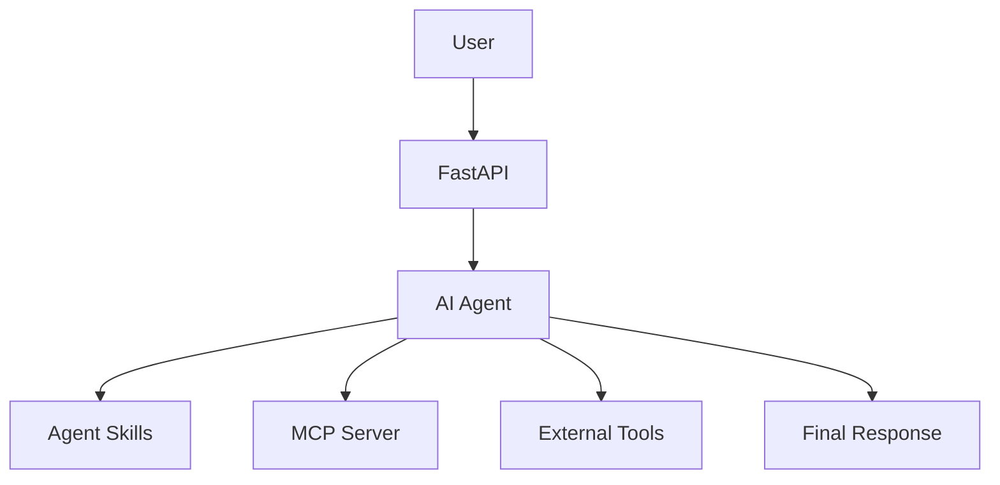

# AAASE Capstone Project

**Advanced Agentic AI Systems Engineering**
**هندسة أنظمة الذكاء الاصطناعي الوكيلي المتقدمة**
SDAIA Academy
August 2026

---

## Capstone Overview

The final capstone is your opportunity to apply what you learned throughout the course by building an AI agent around a clear **problem or purpose**.

There is no skeleton code for the capstone.

You are expected to define what you want to build, choose an appropriate agent architecture and stack, implement it, test it, document it, and demonstrate the result.

Your project does **not** need to use every technology covered in the course.

Choose the tools that make sense for what you are building.

A small, well-designed agent with a clear purpose is better than a complicated system with unnecessary components.

---

# Project Requirements

The capstone is worth **3 points**.

## 1 Point — Build a Working Agent

Your project must contain an AI agent that runs and performs its intended behavior.

The agent should do more than simply forward a prompt to an LLM.

Depending on your project, your agent may use:

* tools
* structured outputs
* workflows
* multiple agents
* Agent Skills
* MCP
* APIs
* databases
* web search
* code execution
* external services
* FastAPI
* OpenResponses
* LangSmith
* containers
* other appropriate technologies

The specific framework is your choice.

You may use LangGraph, LangChain, Deep Agents, another agent framework, or your own implementation.

The important requirement is that the agent works and performs the behavior you designed it for.

---

## 1 Point — Apply the Agent to a Problem or Purpose

Your agent must have a **clear reason to exist**.

This can take two broad forms.

### A. Solve a Problem

Your agent may address a practical problem, task, or workflow.

Start with the problem, not the framework.

For example:

> Students spend significant time reading long technical documents and extracting the information required for an exam.

A possible solution could be:

> An AI study agent that analyzes uploaded documents, extracts important concepts, generates structured study notes, and creates questions for revision.

Other examples include:

* analyzing cybersecurity logs
* assisting with research
* automating repetitive workflows
* processing documents
* supporting customer service
* analyzing business or engineering data
* helping users search and organize information
* assisting with software development
* supporting education or training
* monitoring systems or infrastructure

The problem does not need to be large or commercially significant.

It should simply be clear **what problem is being addressed, who or what benefits, and how the agent contributes to solving it**.

---

### B. Serve a Purpose

Your agent does not have to solve a conventional practical problem.

It may instead serve a clear artistic, experimental, educational, research, entertainment, or exploratory purpose.

Examples include:

* an interactive storytelling agent
* an agent that creates or explores fictional worlds
* an artistic generative experience
* an experimental multi-agent society
* an educational agent for exploring a technical concept
* an agent that demonstrates an unusual interaction model
* an experimental agent communication system
* an agent for exploring human-AI interaction
* a game or simulation agent
* a research prototype investigating agent behavior
* a creative tool for generating or transforming ideas

For these projects, the important question is not necessarily:

> What problem does this solve?

Instead, it may be:

> What experience does this create?

> What idea does this explore?

> What behavior does this demonstrate?

> What is the intended purpose of the agent?

The purpose does not need to be commercial or utilitarian.

Artistic, experimental, educational, research-oriented, and exploratory projects are fully acceptable.

The important requirement is that it is clear **why the agent exists, what it is intended to do, and what value, insight, utility, or experience it provides**.

---

## 1 Point — Explain and Demonstrate the Project

Choose **one** primary format:

### Option A — Project Presentation

Prepare a presentation explaining your project.

### Option B — High-Quality README

Use your GitHub repository README as the primary project documentation.

### Option C — Video Demo

Record a video demonstrating and explaining the project.

The video may be uploaded to YouTube or another accessible platform.

---

Regardless of which format you choose, you must explain:

1. **The Problem or Purpose**
2. **Your AI / Agent Solution or Design**
3. **Your Agent Stack and Architecture**

Your GitHub repository must still contain a useful README even if you choose a presentation or video as your primary submission format.

---

# Recommended Project Structure

There is no required repository structure, but a clean project could look like:

```text
my-agent-project/
├── README.md
├── pyproject.toml
├── .env.example
├── .gitignore
│
├── src/
│   ├── agent.py
│   ├── tools.py
│   ├── api.py
│   └── ...
│
├── skills/
│   └── ...
│
├── tests/
│   └── ...
│
├── Dockerfile
├── compose.yaml
│
└── assets/
    └── architecture.png
```

Only include files that your project actually needs.

---

# README Requirements

Every project repository should include a useful `README.md`.

At minimum, document the following sections.

---

## Project Name

Give your project a clear name.

The name should make it reasonably easy to understand what the project is about.

---

## Problem or Purpose

Describe what motivated the project.

If your project solves a practical problem, explain:

* who or what experiences the problem
* what currently makes the task difficult
* why solving it is useful
* what improvement your agent provides

If your project is artistic, experimental, educational, research-oriented, or exploratory, explain:

* what idea you are exploring
* what experience you are creating
* what behavior you want the agent to demonstrate
* why you chose to build it
* what value, insight, or experience you expect it to provide

This section should make it clear **why your agent exists**.

---

## Solution or Agent Design

Explain how the agent addresses the problem or fulfills the intended purpose.

Describe what the system receives, what the agent does, and what the system produces.

For a practical project:

```text
User provides server logs
        ↓
Agent analyzes events
        ↓
Agent calls threat-intelligence tools
        ↓
Agent classifies suspicious activity
        ↓
Agent produces an incident report
```

For an artistic or experimental project:

```text
User enters a theme
        ↓
Agent creates a fictional world state
        ↓
Characters interact through multiple agents
        ↓
World state changes over time
        ↓
User experiences an evolving narrative
```

The exact form depends on your project.

---

## How the Agent Works

Describe the agent workflow.

Explain:

* what the agent receives
* what decisions it makes
* what tools or data it uses
* what actions it performs
* how the final result is produced

A simple workflow is completely acceptable.

For example:

```text
User Request
     ↓
Agent
 ├── Search Tool
 ├── Analysis Skill
 └── Structured Output
     ↓
Final Report
```

A more involved project may look like:

```text
Client
   ↓
FastAPI
   ↓
Deep Agent
 ├── Agent Skills
 ├── MCP
 ├── External APIs
 └── Execution Environment
   ↓
Result
```

An experimental multi-agent project may look like:

```text
User
 ↓
Coordinator Agent
 ├── Agent A
 ├── Agent B
 └── Agent C
      ↓
Shared State / Environment
      ↓
Emergent Result
```

---

## Architecture

Include at least one architecture diagram.

You may use:

* Mermaid
* Excalidraw
* draw.io
* Figma
* PowerPoint
* another diagramming tool

A simple Mermaid diagram is sufficient.

Example:



The purpose of the diagram is to make the system understandable.

It does not need to be visually complicated.

---

## Agent Stack

List the important technologies used by the project.

For example:

```text
LLM:
OpenRouter

Agent Framework:
Deep Agents

API:
FastAPI

Agent Protocol:
OpenResponses

Tools:
FastMCP

Skills:
Agent Skills

Observability:
LangSmith

Deployment:
Podman
```

Explain **why** important technologies were selected when appropriate.

Do not add technologies simply to make the stack larger.

Your architecture should serve the project, not the other way around.

---

## Installation

Provide enough information for another person to run the project.

For example:

```bash
git clone <repository-url>
cd <repository>

uv sync
```

Create the environment file:

```bash
cp .env.example .env
```

Add the required API keys or configuration.

Then run the application:

```bash
uv run python src/main.py
```

Your commands will depend on your project.

---

## Configuration

Never commit real API keys or credentials.

Provide an `.env.example` containing only variable names and safe example values.

Example:

```env
OPENAI_API_KEY=your-key-here
TAVILY_API_KEY=your-key-here
MCP_TOKEN=your-token-here
```

Your real `.env` should be ignored by Git.

---

## Usage

Show at least one real example of how the project is used.

For an API-based agent:

```bash
curl -X POST http://localhost:8000/v1/responses \
  -H "Content-Type: application/json" \
  -d '{
    "input": "Analyze the provided server logs"
  }'
```

For a command-line project, show the relevant command.

For an interactive, artistic, or experimental agent, explain how a user starts and interacts with the experience.

---

## Example Output or Experience

Show what a successful run looks like.

This may include:

* terminal output
* API responses
* screenshots
* generated reports
* LangSmith traces
* frontend screenshots
* generated artifacts
* interaction examples
* simulation results
* graphs
* videos

For artistic or experimental projects, this section may describe or demonstrate the resulting experience rather than a conventional output.

---

## Demo

If you recorded a demo video, include the link here.

Example:

```text
Demo:
https://youtube.com/...
```

You may also include screenshots, GIFs, or other media.

---

## Limitations

Briefly describe what your system does not currently handle well.

Examples:

* limited API rate limits
* no persistent database
* only tested with small files
* depends on external APIs
* limited authentication
* prototype deployment
* no automated evaluation yet
* inconsistent behavior in some scenarios
* limited world state or memory
* experimental interaction design

Understanding the limitations of your own system is part of understanding the system.

---

## Future Work

Optional, but recommended.

Describe what you would improve, extend, or explore with more time.

---

# Teams

You may complete the capstone:

* individually
* in pairs
* in small teams
* in larger teams

There is no required team size.

One person may host the primary working repository.

This person is simply the repository owner. This does not make them the team leader.

Each participant should have the final project available through their own GitHub account, for example through a fork of the team's repository.

---

## Team Members

Team projects should list every participant.

Example:

| Member | GitHub      | Contribution              |
| ------ | ----------- | ------------------------- |
| Name   | `@username` | Agent architecture        |
| Name   | `@username` | MCP integration           |
| Name   | `@username` | API and deployment        |
| Name   | `@username` | Testing and documentation |

Contributions do not need to be identical.

They should simply reflect what each person worked on.

---

# Git and GitHub Expectations

Your project must be hosted on GitHub.

Use Git throughout development rather than uploading the final project only at the end.

A reasonable workflow is:

```bash
git switch -c feat/my-feature
```

Work on the feature.

Inspect your changes:

```bash
git status
git diff
```

Stage your changes:

```bash
git add -p
```

Inspect what will be committed:

```bash
git diff --staged
```

Commit:

```bash
git commit -m "feat: add document analysis tool"
```

Push your branch:

```bash
git push -u origin feat/my-feature
```

For team projects, members are encouraged to use branches and Pull Requests when combining work.

Example:

```text
main
├── feat/frontend
├── feat/mcp-server
├── feat/agent
└── feat/evaluation
```

Your Git history should show meaningful development progress.

Avoid a repository containing only one final commit such as:

```text
final
```

---

# GitHub Project Documentation

Your repository should contain:

* a clear project description
* a professional README
* instructions explaining how to run the project
* appropriate technical documentation
* meaningful Git history
* the training program information
* team information when applicable

You are also encouraged to use normal GitHub collaboration features such as:

* Forks
* Pull Requests
* Issues
* Stars
* Open-source contributions

---

# Course Information

This project was developed as part of:

**Advanced Agentic AI Systems Engineering**
**هندسة أنظمة الذكاء الاصطناعي الوكيلي المتقدمة**

SDAIA Academy
August 9–13, 2026

SDAIA Academy GitHub:

https://github.com/SDAIAAcademy

---

# Grading

The entire course is graded out of **7 points**.

## Daily Project Milestones

| Component | Points |
| --------- | -----: |
| Day 1 Lab |      1 |
| Day 2 Lab |      1 |
| Day 3 Lab |      1 |
| Day 4 Lab |      1 |

Each daily lab is graded as:

```text
1 = completed
0 = not completed
```

---

## Final Capstone

| Requirement                                    | Points |
| ---------------------------------------------- | -----: |
| Agent is built and running                     |      1 |
| Agent is applied to a clear problem or purpose |      1 |
| Project is clearly demonstrated and explained  |      1 |
| **Capstone Total**                             |  **3** |

The second point may be earned by either:

* solving or addressing a practical problem, **or**
* fulfilling a clear artistic, experimental, educational, research, entertainment, or exploratory purpose

Both are equally valid.

---

## Course Total

```text
Daily Labs     4 points
Final Capstone 3 points
──────────────────────
Total          7 points
```

The passing score is:

# **4 / 7**

---

# Capstone Checklist

Before submitting, confirm:

* [ ] My agent runs successfully.
* [ ] My agent has a clearly defined problem or purpose.
* [ ] It is clear why the agent exists.
* [ ] The project is available on GitHub.
* [ ] The repository contains a useful README.
* [ ] The README explains the problem or purpose.
* [ ] The README explains the AI solution or agent design.
* [ ] The README explains the agent stack.
* [ ] The project contains an architecture diagram.
* [ ] Another person can understand how to run or experience the project.
* [ ] No API keys or credentials are committed.
* [ ] My Git history contains meaningful commits.
* [ ] Team members and contributions are listed if applicable.
* [ ] The course and SDAIA Academy are referenced.
* [ ] I prepared a README, presentation, or video explaining the project.

---

# Final Objective

By the end of the capstone, another person should be able to look at your repository and answer:

```text
What is this project trying to achieve?

What problem does it solve or what purpose does it serve?

Why does the agent exist?

How does the agent work?

How is the system designed?

What technologies were used?

How can I run or experience it?

Does it actually work?
```

The objective of the capstone is not to build the largest or most complicated system.

The objective is to demonstrate that you can take a **problem, purpose, or idea**, design an appropriate AI agent around it, implement it, and communicate the result clearly.

